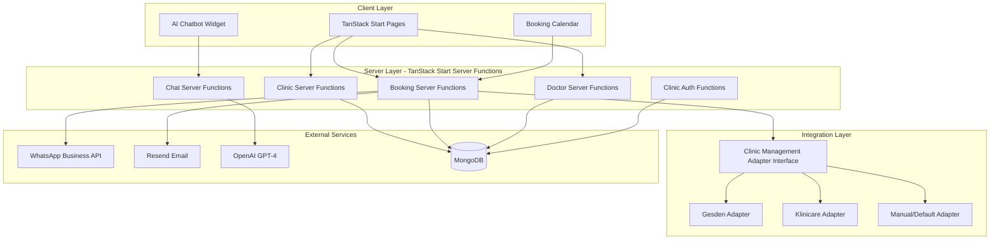
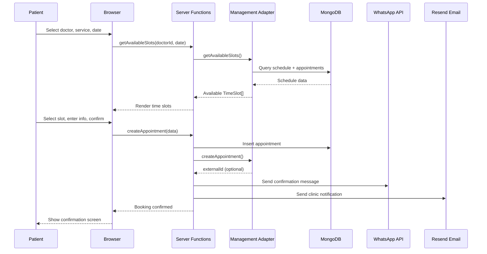

# Denty - Product Requirements Document

## 1. Overview

Denty is a dental appointment booking platform that connects patients with dental clinics. Patients can browse clinics and doctors, book appointments through an interactive calendar, and receive confirmations via WhatsApp. Clinics receive appointment notifications via email. An AI-powered chatbot helps patients with questions about treatments, schedules, and appointment management.

The system is designed to integrate with existing dental clinic management software (Gesden, Klinicare, and others) through an adapter-based architecture, ensuring appointment availability stays in sync with whatever system a clinic already uses.

## 2. Goals

- Allow patients to book dental appointments online without creating an account (phone number only).
- Provide each clinic and doctor with a dedicated public page.
- Keep appointment availability in sync with external management systems (Gesden, Klinicare).
- Send appointment confirmations to patients via WhatsApp.
- Send appointment notifications to clinics via email.
- Offer an AI chatbot that can answer questions about treatments, clinic info, and help manage appointments.
- Support multi-language (Spanish and English).
- Provide clinics with a simple admin panel to manage doctors, appointments, and integration settings.

## 3. Target Users

### Patients
- People looking to book a dental appointment.
- Do not need an account. Only a phone number is required to book.
- May optionally provide an email address.
- After booking, they may be prompted to create an account (post-MVP).

### Dental Clinics (Admins)
- Clinic staff who manage appointments, doctors, and clinic settings.
- Authenticate with email/password.
- Configure integration with their existing management system.

## 4. Tech Stack

| Layer | Technology |
|-------|-----------|
| Framework | TanStack Start (RC) with TanStack Router + TanStack Query |
| Database | MongoDB with official Node.js driver (no Mongoose, no Prisma) |
| UI | shadcn/ui + Tailwind CSS |
| AI Chatbot | OpenAI GPT-4 via `openai` SDK |
| WhatsApp | WhatsApp Business Cloud API (Meta) |
| Email | Resend + React Email |
| i18n | i18next + react-i18next (Spanish + English) |
| Build | Vite + Nitro deployment adapter |

## 5. Information Architecture

### Public Pages

- **`/`** - Landing page. Hero section with live search bar (results appear as the user types across clinics, doctors, and treatments), value proposition, "How it works" steps.
- **`/search?q=`** - Unified search results page. Shows matching clinics, doctors, and treatments in grouped sections with result counts.
- **`/clinics`** - Clinic listing. Searchable grid of clinic cards.
- **`/clinics/:clinic-slug`** - Clinic detail page. Name, address, phone, working hours, services with prices, list of doctors, "Book Appointment" CTA.
- **`/doctors`** - Doctor listing. Searchable grid of doctor cards.
- **`/doctors/:doctor-slug`** - Doctor detail page. Name, photo, specialization, bio, schedule, linked clinic, "Book Appointment" CTA.
- **`/treatments`** - Treatment listing. Grid of treatment cards grouped by category (Preventive, Cosmetic, Orthodontics, Surgery, Restorative, Pediatric).
- **`/treatments/:treatment-slug`** - Treatment detail page. Name, description, category, duration, price range, related clinics offering the treatment, and specialist doctors.
- **`/book/:clinic-slug`** - Booking flow. Multi-step: select doctor, select service, pick date/time from calendar, enter patient info (name, phone), confirm.

### Admin Pages

- **`/admin/login`** - Email/password login for clinic staff.
- **`/admin/dashboard`** - Today's appointments, upcoming appointments, quick stats.
- **`/admin/appointments`** - Full appointment list with filters (date, status, doctor). Cancel/confirm actions.
- **`/admin/doctors`** - Add, edit, remove doctors. Set schedules and services per doctor.
- **`/admin/settings`** - Edit clinic info, working hours, services. Configure management system integration (select adapter type, enter API credentials).

### Persistent UI

- **Header** - Logo, navigation links (Clinics, Doctors, Treatments), language switcher (ES/EN).
- **Footer** - Links, copyright.
- **AI Chatbot Widget** - Floating button in bottom-right corner, opens chat panel. Available on all public pages.

## 6. Features

### 6.1 Clinic Pages

**`/clinics`**
- Grid of clinic cards showing name, city, number of doctors, and a short description.
- Search/filter by name or city.

**`/clinics/:clinic-slug`**
- Full clinic profile: name, logo, description, address (with map link), phone, email, website.
- Working hours displayed in a weekly table.
- List of services with name, duration, and optional price.
- List of doctors (cards linking to their individual pages).
- Prominent "Book Appointment" button linking to `/book/:clinic-slug`.

### 6.2 Doctor Pages

**`/doctors`**
- Grid of doctor cards showing name, photo, specialization, and linked clinic name.
- Search/filter by name or specialization.

**`/doctors/:doctor-slug`**
- Full profile: name, photo, specialization, bio.
- Weekly schedule (days and hours).
- Services this doctor provides.
- Link to parent clinic.
- "Book Appointment" button linking to `/book/:clinic-slug?doctor=:doctor-slug`.

### 6.3 Treatment Pages

**`/treatments`**
- Grid of treatment cards grouped by category (Preventive, Cosmetic, Orthodontics, Surgery, Restorative, Pediatric).
- Each card shows treatment name, short description, duration, and price range.
- Cards link to the individual treatment detail page.

**`/treatments/:treatment-slug`**
- Full treatment profile: name, category badge, detailed description.
- Info cards showing duration (in minutes) and price range.
- "Clinics offering this treatment" section: lists clinics whose services match the treatment, displayed as clickable cards.
- "Specialists in this treatment" section: lists doctors whose specialization matches, displayed as clickable cards with clinic name.
- Breadcrumb navigation (Home / Treatment Name).

### 6.4 Unified Search

**Landing page search bar (`/`):**
- Pill-shaped search bar prominently placed in the hero section.
- Live results dropdown appears after typing 2+ characters.
- Results are grouped by type (Clinics, Doctors, Treatments) with distinct icons and section headers.
- Each result links directly to its detail page (`/clinics/:slug`, `/doctors/:slug`, `/treatments/:slug`).
- Pressing Enter or clicking the Search button navigates to the unified search results page.
- Clear button (X) to reset the input. Click-outside-to-close behavior.
- Maximum 8 results shown in the dropdown.

**Search results page (`/search?q=`):**
- Shows all matching clinics, doctors, and treatments in separate sections.
- Each section has a count badge and uses the same card layout as listing pages.
- Treatment cards show description, duration, and price range.
- Empty state message when no results match.

**Booking flow at `/book/:clinic-slug`:**

1. **Select Doctor** - Dropdown or card selection. Pre-selected if coming from a doctor page.
2. **Select Service** - List of services the selected doctor provides, showing name and duration.
3. **Select Date & Time** - Calendar component showing available dates. Clicking a date reveals available time slots. Slots are fetched from the adapter layer (synced with external management system or Denty's own availability).
4. **Patient Information** - Form fields:
   - Name (required)
   - Phone number (required, used for WhatsApp confirmation)
   - Email (optional)
   - Notes/reason (optional)
5. **Confirmation** - Summary of selected doctor, service, date/time, patient info. "Confirm Booking" button.
6. **Success Screen** - Appointment confirmed. Details displayed. Message that a WhatsApp confirmation will be sent.

**Availability rules:**
- Time slots are determined by the clinic's management system adapter.
- For clinics using the Manual adapter, availability is calculated from the doctor's schedule minus existing confirmed appointments.
- Slot duration matches the selected service's duration.
- No double-booking: once a slot is taken, it is removed from available slots.

### 6.6 Notifications

**WhatsApp (to patient):**
- Sent immediately after a successful booking.
- Uses WhatsApp Business Cloud API with a pre-approved message template.
- Contains: clinic name, doctor name, service, date, time, clinic address.
- Sent to the phone number provided during booking.

**Email (to clinic):**
- Sent immediately after a successful booking.
- Uses Resend with a React Email template.
- Contains: patient name, patient phone, service, doctor, date, time, any notes.
- Sent to the clinic's configured email address.

**Error handling:**
- If WhatsApp or email fails, the appointment is still created.
- Flags `whatsappSent` and `emailSent` on the appointment record.
- Admin dashboard shows notification status per appointment.

### 6.7 AI Chatbot

**Behavior:**
- Floating widget available on all public pages. Bottom-right corner.
- Click to open a chat panel with message history.
- Powered by OpenAI GPT-4 Chat Completions API.
- System prompt is dynamically built with clinic context from MongoDB:
  - Clinic name, address, phone, working hours.
  - List of services with descriptions and prices.
  - List of doctors with specializations.
- The chatbot can:
  - Answer questions about treatments, prices, and procedures.
  - Provide clinic address, phone, and working hours.
  - Describe available doctors and their specializations.
  - Redirect users to the booking page when they want to make an appointment.
- Chat sessions are persisted in MongoDB for continuity.

**Function calling:**
- The chatbot uses OpenAI function calling to trigger a "navigate to booking page" action when the user wants to book.

### 6.8 Management System Integration (Adapter Layer)

**Architecture:**
- A `ClinicManagementAdapter` interface defines the contract for all integrations.
- Each clinic is configured with a `managementSystem` field (`'manual'`, `'gesden'`, `'klinicare'`, or a custom string).
- An adapter factory returns the correct adapter implementation based on the clinic's configuration.

**Adapter Interface:**
```typescript
interface ClinicManagementAdapter {
  getAvailableSlots(doctorId: string, date: Date): Promise<TimeSlot[]>
  createAppointment(appointment: AppointmentData): Promise<{ externalId?: string }>
  cancelAppointment(appointmentId: string): Promise<void>
  syncDoctors?(): Promise<DoctorData[]>
}
```

**Implementations:**
- **ManualAdapter** (default): Reads doctor schedules and existing appointments from Denty's MongoDB. Calculates available slots by subtracting booked slots from the doctor's defined schedule. Fully functional out of the box.
- **GesdenAdapter** (stub): Implements the interface with placeholder logic. Throws a descriptive error indicating the integration is pending API access. Includes a configuration schema for future use (API endpoint, credentials).
- **KlinicareAdapter** (stub): Same approach as Gesden. Ready to be implemented when API documentation becomes available.

**Adding a new integration:**
1. Create a new file in `src/adapters/` implementing `ClinicManagementAdapter`.
2. Register it in the adapter factory.
3. Clinics can select it from the admin settings page.

### 6.9 Clinic Admin Panel

**Authentication:**
- Email/password login. Passwords hashed with bcrypt.
- JWT stored in an HTTP-only cookie for session management.
- No patient authentication in MVP.

**Dashboard (`/admin/dashboard`):**
- Today's appointments list with patient name, doctor, service, time, status.
- Upcoming appointments (next 7 days).
- Quick stats: total appointments this week, pending confirmations.

**Appointments (`/admin/appointments`):**
- Full list of appointments with filters: date range, status, doctor.
- Actions: confirm, cancel.
- Shows WhatsApp/email notification status per appointment.

**Doctors (`/admin/doctors`):**
- List of clinic's doctors.
- Add new doctor: name, specialization, bio, photo URL, schedule, services.
- Edit existing doctor.
- Remove doctor (soft-delete or mark inactive).

**Settings (`/admin/settings`):**
- Edit clinic information: name, description, address, phone, email, working hours.
- Manage services: add, edit, remove. Each service has a name (multi-language), duration, optional price.
- Management system configuration: select adapter type from dropdown, enter adapter-specific settings (API URL, credentials).

### 6.10 Internationalization

- All user-facing text supports Spanish and English.
- Language switcher in the header toggles between ES and EN.
- Clinic descriptions, service names, doctor specializations, bios, and treatment names/descriptions are stored as `Record<string, string>` (keyed by locale) in MongoDB.
- Static UI text uses i18next translation files (`es.json`, `en.json`).
- Default language: Spanish. Detectable from browser preferences.

## 7. Data Model

### `clinics` Collection
| Field | Type | Description |
|-------|------|-------------|
| `_id` | ObjectId | Primary key |
| `slug` | string | Unique, URL-friendly identifier |
| `name` | string | Clinic display name |
| `description` | Record\<string, string\> | Localized descriptions (es, en) |
| `address` | object | street, city, zip, optional coordinates |
| `phone` | string | Contact phone |
| `email` | string | Contact email (receives appointment notifications) |
| `website` | string? | Optional website URL |
| `logo` | string? | Logo image URL |
| `managementSystem` | string | Adapter type: 'manual', 'gesden', 'klinicare' |
| `managementConfig` | object? | Adapter-specific configuration |
| `workingHours` | array | Objects with day (0-6), open, close times |
| `services` | array | Objects with name (localized), duration (min), price |
| `adminEmail` | string | Admin login email |
| `adminPasswordHash` | string | Bcrypt-hashed admin password |
| `createdAt` | Date | Record creation timestamp |
| `updatedAt` | Date | Last update timestamp |

### `doctors` Collection
| Field | Type | Description |
|-------|------|-------------|
| `_id` | ObjectId | Primary key |
| `slug` | string | Unique, URL-friendly identifier |
| `clinicId` | ObjectId | Reference to parent clinic |
| `name` | string | Doctor display name |
| `specialization` | Record\<string, string\> | Localized specialization text |
| `bio` | Record\<string, string\> | Localized biography |
| `photo` | string? | Photo URL |
| `schedule` | array | Objects with day (0-6), startTime, endTime |
| `services` | string[] | Service names this doctor provides |
| `createdAt` | Date | Record creation timestamp |

### `appointments` Collection
| Field | Type | Description |
|-------|------|-------------|
| `_id` | ObjectId | Primary key |
| `clinicId` | ObjectId | Reference to clinic |
| `doctorId` | ObjectId | Reference to doctor |
| `patientName` | string | Patient's full name |
| `patientPhone` | string | Patient's phone (WhatsApp number) |
| `patientEmail` | string? | Optional patient email |
| `service` | string | Service name |
| `date` | Date | Appointment date and time |
| `duration` | number | Duration in minutes |
| `status` | string | 'pending', 'confirmed', 'cancelled', 'completed' |
| `externalId` | string? | ID in the external management system |
| `notes` | string? | Patient notes or reason for visit |
| `whatsappSent` | boolean | Whether WhatsApp confirmation was sent |
| `emailSent` | boolean | Whether clinic email was sent |
| `createdAt` | Date | Record creation timestamp |

### `chat_sessions` Collection
| Field | Type | Description |
|-------|------|-------------|
| `_id` | ObjectId | Primary key |
| `clinicId` | ObjectId? | Associated clinic (if chatting on a clinic page) |
| `sessionId` | string | Client-generated session identifier |
| `messages` | array | Objects with role ('user'/'assistant'), content, timestamp |
| `createdAt` | Date | Session creation timestamp |
| `updatedAt` | Date | Last message timestamp |

### MongoDB Indexes
- `clinics`: unique index on `slug`, unique index on `adminEmail`
- `doctors`: unique index on `slug`, index on `clinicId`
- `appointments`: compound index on `clinicId` + `doctorId` + `date`, index on `status`
- `chat_sessions`: index on `sessionId`

## 8. Architecture

### System Diagram



### Booking Flow Sequence



## 9. Project Structure

```
denty/
├── src/
│   ├── routes/
│   │   ├── __root.tsx
│   │   ├── index.tsx
│   │   ├── search.tsx
│   │   ├── clinics/
│   │   │   ├── index.tsx
│   │   │   └── $clinicSlug.tsx
│   │   ├── doctors/
│   │   │   ├── index.tsx
│   │   │   └── $doctorSlug.tsx
│   │   ├── treatments/
│   │   │   ├── index.tsx
│   │   │   └── $treatmentSlug.tsx
│   │   ├── book/
│   │   │   └── $clinicSlug.tsx
│   │   └── admin/
│   │       ├── login.tsx
│   │       ├── dashboard.tsx
│   │       ├── appointments.tsx
│   │       ├── doctors.tsx
│   │       └── settings.tsx
│   ├── server/
│   │   ├── clinics.ts
│   │   ├── doctors.ts
│   │   ├── appointments.ts
│   │   ├── auth.ts
│   │   ├── chat.ts
│   │   ├── availability.ts
│   │   └── notifications.ts
│   ├── lib/
│   │   ├── db.ts
│   │   ├── collections.ts
│   │   └── utils.ts
│   ├── adapters/
│   │   ├── types.ts
│   │   ├── manual.ts
│   │   ├── gesden.ts
│   │   ├── klinicare.ts
│   │   └── factory.ts
│   ├── components/
│   │   ├── ui/
│   │   ├── hero-search.tsx
│   │   ├── booking-calendar.tsx
│   │   ├── booking-form.tsx
│   │   ├── chat-widget.tsx
│   │   ├── clinic-card.tsx
│   │   ├── doctor-card.tsx
│   │   ├── language-switcher.tsx
│   │   └── layout/
│   │       ├── header.tsx
│   │       └── footer.tsx
│   ├── data/
│   │   └── mock.ts
│   ├── emails/
│   │   ├── appointment-confirmation.tsx
│   │   └── appointment-reminder.tsx
│   ├── i18n/
│   │   ├── config.ts
│   │   ├── es.json
│   │   └── en.json
│   └── styles.css
├── scripts/
│   └── seed.ts
├── .env
├── .env.example
├── vite.config.ts
├── tsconfig.json
├── package.json
├── PRD.md
└── README.md
```

## 10. Environment Variables

| Variable | Description |
|----------|-------------|
| `MONGODB_URI` | MongoDB connection string |
| `WHATSAPP_TOKEN` | WhatsApp Business Cloud API access token |
| `WHATSAPP_PHONE_NUMBER_ID` | WhatsApp sender phone number ID |
| `OPENAI_API_KEY` | OpenAI API key for chatbot |
| `RESEND_API_KEY` | Resend API key for email |
| `JWT_SECRET` | Secret for signing admin JWT tokens |

## 11. Implementation Phases

### Phase 1: Project Scaffolding + Database
- Initialize TanStack Start project with Tailwind CSS and shadcn/ui.
- Configure MongoDB connection using the official Node.js driver (singleton pattern).
- Set up i18n with i18next (Spanish + English, browser detection, language switcher).
- Create the base layout: `__root.tsx`, header (with Clinics, Doctors, Treatments nav), footer.
- Landing page with hero search bar and "How it works" section.

### Phase 2: Clinics, Doctors, and Treatments
- Create typed MongoDB collection accessors for clinics, doctors, and treatments.
- Implement clinic, doctor, and treatment server functions (read operations for public, CRUD for admin).
- Build `/clinics` listing page with clinic cards (search/filter).
- Build `/clinics/:clinic-slug` detail page (full profile, services, doctors, CTA).
- Build `/doctors` listing page with doctor cards.
- Build `/doctors/:doctor-slug` detail page (profile, schedule, clinic link, CTA).
- Build `/treatments` listing page with treatment cards grouped by category.
- Build `/treatments/:treatment-slug` detail page (description, duration, price, related clinics and doctors).
- Build `/search` unified search results page (clinics, doctors, treatments).
- Build hero search bar with live dropdown results.
- Create a seed script with sample clinic, doctor, and treatment data.

### Phase 3: Booking System + Adapter Layer
- Define `ClinicManagementAdapter` interface.
- Implement `ManualAdapter` (slot calculation from schedules and appointments).
- Create `GesdenAdapter` and `KlinicareAdapter` stubs.
- Implement adapter factory.
- Build availability server function.
- Build booking calendar component (date picker + time slot grid).
- Build booking form component (patient info).
- Implement appointment creation server function.
- Build booking confirmation screen.

### Phase 4: Notifications
- Integrate WhatsApp Business Cloud API for patient confirmations.
- Set up Resend with React Email templates.
- Build appointment confirmation email template.
- Implement notification server functions with error handling and status flags.

### Phase 5: AI Chatbot
- Integrate OpenAI Chat Completions API.
- Build system prompt builder that injects clinic context from MongoDB.
- Build chat widget UI (floating button, message panel, input field).
- Implement chat session persistence in MongoDB.
- Add function calling for booking page navigation.

### Phase 6: Clinic Admin Panel
- Implement email/password authentication (bcrypt + JWT cookie).
- Build admin login page.
- Build dashboard with appointment lists and quick stats.
- Build doctor management page (add, edit, remove).
- Build settings page (clinic info, services, management system configuration).

## 12. Non-Functional Requirements

- **Performance**: Pages should load within 2 seconds. Use TanStack Query caching to minimize redundant database calls.
- **SEO**: Clinic and doctor pages are server-rendered for search engine visibility. Use TanStack Start's `head()` for meta tags per route.
- **Security**: Admin passwords hashed with bcrypt. JWT tokens in HTTP-only cookies. Server functions validate all inputs. No sensitive data exposed to the client.
- **Accessibility**: Follow WCAG 2.1 AA guidelines. shadcn/ui components are accessible by default. Ensure proper ARIA labels, keyboard navigation, and color contrast.
- **Mobile**: Fully responsive design. The booking calendar and chat widget must work well on mobile screens.
- **Error Handling**: Graceful error boundaries per route. Notification failures do not block appointment creation. Clear error messages for users.

## 13. Future Considerations (Post-MVP)

- Patient accounts with appointment history.
- SMS fallback if WhatsApp delivery fails.
- Appointment reminders (24h before, via WhatsApp).
- Online payment integration.
- Reviews and ratings for clinics and doctors.
- Real Gesden and Klinicare API integrations when access is available.
- Multi-clinic admin accounts (clinic chains).
- Analytics dashboard for clinics.
- Waitlist functionality for fully-booked slots.
