# Denty - Product Requirements Document

## 1. Overview

Denty is an **AI agent for dental clinics**. Each clinic gets its own Denty — an always-on digital employee that manages appointments, talks to patients, maintains the clinic's website, handles social media, and keeps the practice running smoothly 24/7.

Patients interact with Denty through **conversation** — via WhatsApp, Instagram DMs, or web chat — to book appointments, ask questions, get reminders, and more. Clinic owners talk to Denty like they'd talk to a human assistant: "Block next Friday afternoon", "Send a reminder to patients who haven't visited in 6 months", "Post something about our new whitening offer".

The system is designed with a **"start dental, build generic"** philosophy. The architecture supports any service business vertical, but the product, language, and workflows are purpose-built for dental clinics first.

Think of it as **"OpenClaw for dental clinics"** — each clinic is one agent instance with its own data, personality, connected channels, and capabilities.

## 2. Goals

- Provide each dental clinic with its own **AI agent** that acts as a digital employee.
- Enable **conversational appointment booking** — patients book by chatting on WhatsApp, Instagram, or web, not by navigating forms.
- Keep appointment availability in sync with external management systems (Gesden, Klinicare) through an adapter layer.
- Automate **patient relationship management**: follow-ups, reminders, recall campaigns, birthday messages.
- **Generate and maintain** a professional clinic website with SEO optimization.
- Manage the clinic's **social media presence**: content generation, DM responses, review management.
- Offer **24/7 availability** — the agent never sleeps, never calls in sick, never takes vacation.
- Support multi-language (Spanish and English), with agent personality adapting to each clinic's tone.
- Replace the traditional admin panel with a **conversational admin interface** — the dentist manages their clinic by talking to Denty.

## 3. Target Users

### Patients
- People looking to book a dental appointment or get information about treatments.
- Interact with Denty through WhatsApp, Instagram, or web chat — no app download, no account creation.
- Only a phone number is needed to book.
- Receive reminders, follow-ups, and care instructions through the same channel.

### Dental Clinics (Owners/Staff)
- Clinic owners and staff who want to offload administrative work.
- Talk to Denty to manage appointments, doctors, schedules, and settings.
- View dashboards and reports through the web interface or ask Denty for summaries.
- Onboard by having a conversation, not by filling out forms.

### The Denty Agent (Conceptual)
- Each clinic's Denty instance is a first-class entity with:
  - Its own identity (name, personality, tone of voice)
  - Its own data (patients, appointments, history)
  - Its own connected channels (WhatsApp number, Instagram account, website)
  - Its own capabilities (determined by the clinic's plan)

## 4. Tech Stack

| Layer | Technology |
|-------|-----------|
| Framework | TanStack Start (RC) with TanStack Router + TanStack Query |
| Database | MongoDB with official Node.js driver (no Mongoose, no Prisma) |
| UI | shadcn/ui + Tailwind CSS |
| AI Core | OpenAI GPT-4 via `openai` SDK |
| WhatsApp | WhatsApp Business Cloud API (Meta) |
| Instagram | Instagram Messaging API (Meta) |
| Email | Resend + React Email |
| i18n | i18next + react-i18next (Spanish + English) |
| Build | Vite + Nitro deployment adapter |

## 5. Agent Architecture

### 5.1 One Clinic = One Agent

Each clinic gets a dedicated agent instance with:

- **Identity**: Clinic name, personality configuration, tone of voice, language preferences.
- **Knowledge Base**: Clinic info, services, pricing, doctors, schedules, FAQs, treatment details — all injected as agent context.
- **Memory**: Conversation history per patient, appointment history, interaction logs.
- **Channels**: Connected communication channels (WhatsApp, Instagram, web chat, email).
- **Capabilities**: Determined by the clinic's subscription plan (booking, CRM, website, social media).
- **Tools**: Functions the agent can call — book appointment, check availability, send reminder, update website, create post, etc.

### 5.2 Agent Capabilities

The agent uses **function calling** to perform actions:

| Capability | Functions |
|-----------|-----------|
| Booking | `check_availability`, `create_appointment`, `cancel_appointment`, `reschedule_appointment` |
| Patient Info | `get_patient_history`, `update_patient_record`, `search_patients` |
| Reminders | `send_reminder`, `schedule_follow_up`, `send_recall_campaign` |
| Clinic Management | `update_schedule`, `block_time_slot`, `add_service`, `update_pricing` |
| Website | `update_website_content`, `publish_blog_post`, `update_seo_settings` |
| Social Media | `create_social_post`, `reply_to_review`, `schedule_content` |

### 5.3 Conversation Routing

```
Patient message (WhatsApp/Instagram/Web)
  → Channel Adapter (normalize message format)
  → Agent Router (identify clinic + patient)
  → Agent Instance (clinic-specific context loaded)
  → Response + Actions (function calls executed)
  → Channel Adapter (format response for channel)
  → Patient receives reply
```

### 5.4 Admin Conversations

Clinic owners interact with Denty through a dedicated admin channel:

- **Natural language management**: "Show me tomorrow's appointments", "Add Dr. García to the team", "We're closed next Monday"
- **Reports on demand**: "How many new patients this month?", "What's our busiest day?"
- **Settings changes**: "Change our WhatsApp greeting message", "Update the cleaning price to €80"
- Falls back to a **web dashboard** for complex operations (bulk edits, visual calendar, analytics charts).

## 6. Conversational Interface

### 6.1 Supported Channels

| Channel | Patient | Admin | Priority |
|---------|---------|-------|----------|
| WhatsApp Business | ✅ | ✅ | Phase 1 |
| Web Chat Widget | ✅ | ✅ | Phase 1 |
| Instagram DMs | ✅ | ❌ | Phase 2 |
| SMS | ✅ | ❌ | Future |
| Telegram | ✅ | ❌ | Future |

### 6.2 Patient Conversation Flows

**Booking Flow (via WhatsApp example):**
```
Patient: Hola, quiero pedir cita para una limpieza
Denty: ¡Hola! 😊 Claro, te ayudo. Para una limpieza dental tenemos disponibilidad:
       📅 Martes 18 — 10:00, 12:30, 16:00
       📅 Miércoles 19 — 09:00, 11:00, 17:30
       📅 Jueves 20 — 10:00, 15:00
       ¿Cuál te viene mejor?
Patient: El martes a las 10
Denty: Perfecto. Tu cita queda así:
       🦷 Limpieza dental
       👨‍⚕️ Dr. Martínez
       📅 Martes 18 de febrero, 10:00
       📍 Clínica Dental Sonrisa, C/ Gran Vía 42
       ¿Confirmo?
Patient: Sí
Denty: ✅ ¡Cita confirmada! Te enviaré un recordatorio el día anterior. ¡Hasta el martes!
```

**FAQ Handling:**
- Treatment information, pricing, clinic hours, location, insurance questions
- Agent draws from clinic-specific knowledge base
- Gracefully escalates to human when needed

**Post-Visit Follow-up (automated):**
```
Denty: ¡Hola María! ¿Qué tal te fue ayer con el Dr. Martínez? Esperamos que todo bien 😊
       Si tienes alguna molestia o duda, estoy aquí para ayudarte.
```

### 6.3 Web Chat Widget

- Floating widget available on the clinic's website (generated or external).
- Same conversational capabilities as WhatsApp.
- Can hand off to booking calendar for visual date/time selection.
- Persisted sessions — patient can return and continue conversation.

## 7. Features

### 7.1 Appointment Booking & Management

All existing booking features from the original platform apply, now accessed primarily through conversation:

- **Conversational booking**: Patients book by chatting — the agent handles doctor selection, service selection, date/time picking, and confirmation.
- **Visual booking fallback**: Web calendar available for patients who prefer clicking over chatting.
- **Availability sync**: Adapter layer keeps slots in sync with Gesden, Klinicare, or manual schedules.
- **Appointment management**: Patients can reschedule or cancel via conversation.
- **Smart suggestions**: Agent suggests optimal times based on patient history and preferences.
- **No-show handling**: Automated follow-up for missed appointments.

**Availability rules** (unchanged):
- Time slots determined by the clinic's management system adapter.
- ManualAdapter calculates from doctor schedules minus existing confirmed appointments.
- Slot duration matches selected service duration.
- No double-booking.

### 7.2 Patient Relationship Management (CRM)

- **Patient profiles**: Auto-built from interactions — name, phone, email, visit history, preferences, notes.
- **Automated reminders**: 24h and 1h before appointments via the patient's preferred channel.
- **Recall campaigns**: "Patients who haven't visited in 6+ months" — agent sends personalized re-engagement messages.
- **Follow-up sequences**: Post-treatment care instructions, satisfaction check, review request.
- **Birthday/milestone messages**: Personal touch automation.
- **Treatment plans**: Track multi-visit treatments (orthodontics, implants) with scheduled follow-ups.
- **Patient segments**: Group patients by treatment type, visit frequency, revenue, etc.

### 7.3 Clinic Website Generation & SEO

The agent generates and maintains a professional website for each clinic:

- **Auto-generated pages**: Home, About, Services, Doctors, Contact, Blog.
- **SEO optimized**: Meta tags, schema markup (LocalBusiness, Dentist), sitemap, fast loading.
- **Content from conversation**: "Denty, add a page about our new Invisalign service" → agent creates it.
- **Booking integration**: Every page has CTAs that open the chat or booking calendar.
- **Blog/content**: Agent can generate dental health articles for SEO.
- **Mobile responsive**: All generated sites are mobile-first.
- **Custom domain**: Clinics can use their own domain or a denty.es subdomain.

### 7.4 Social Media Management

- **Content generation**: Agent creates posts about treatments, tips, promotions, seasonal content.
- **DM responses**: Auto-reply to Instagram DMs with booking links and info.
- **Review management**: Monitor and respond to Google Reviews, suggest responses for negative reviews.
- **Content calendar**: Schedule posts in advance, maintain consistent posting.
- **Platform support**: Instagram, Facebook, Google Business Profile (Phase 1). TikTok (future).

### 7.5 Notifications

**WhatsApp (to patient):**
- Booking confirmation with details.
- 24h and 1h reminders.
- Post-visit follow-up.
- Recall/re-engagement messages.

**Email (to clinic):**
- New appointment notifications.
- Daily/weekly appointment summaries.
- Patient no-show alerts.
- Monthly performance reports.

**Error handling** (unchanged):
- Notification failures don't block appointment creation.
- Status flags (`whatsappSent`, `emailSent`) on appointment records.

### 7.6 Management System Integration (Adapter Layer)

Architecture and interface unchanged from original design:

```typescript
interface ClinicManagementAdapter {
  getAvailableSlots(doctorId: string, date: Date): Promise<TimeSlot[]>
  createAppointment(appointment: AppointmentData): Promise<{ externalId?: string }>
  cancelAppointment(appointmentId: string): Promise<void>
  syncDoctors?(): Promise<DoctorData[]>
}
```

**Implementations:**
- **ManualAdapter** (default): Reads schedules and appointments from MongoDB.
- **GesdenAdapter** (stub): Ready for implementation when API access available.
- **KlinicareAdapter** (stub): Ready for implementation when API access available.

### 7.7 Agent Onboarding Flow

Onboarding is a conversation, not a tutorial:

```
Denty: ¡Hola! Soy Denty, tu nuevo asistente digital 🦷
       Vamos a configurar tu clínica. Primero, ¿cómo se llama?
Owner: Clínica Dental Sonrisa
Denty: ¡Buen nombre! ¿En qué ciudad estáis?
Owner: Madrid, en la calle Gran Vía 42
Denty: Perfecto. ¿Cuántos doctores trabajáis en la clínica?
Owner: Somos 3 — yo soy el Dr. López, y tenemos a la Dra. García y el Dr. Martínez
Denty: Genial. ¿Qué servicios ofrecéis? Dame los principales y luego podemos añadir más.
Owner: Limpiezas, empastes, ortodoncia, blanqueamiento e implantes
Denty: Ya tengo lo básico configurado. Tu clínica ya está activa en denty.es/clinica-dental-sonrisa
       ¿Quieres que conectemos tu WhatsApp para que los pacientes puedan escribirte?
```

### 7.8 Internationalization

Unchanged:
- Spanish and English support.
- Language switcher on web interfaces.
- Localized content stored as `Record<string, string>` in MongoDB.
- Agent detects and adapts to patient's language.

## 8. Data Model

### `agents` Collection (NEW)
| Field | Type | Description |
|-------|------|-------------|
| `_id` | ObjectId | Primary key |
| `clinicId` | ObjectId | Reference to clinic |
| `name` | string | Agent display name (e.g., "Denty de Clínica Sonrisa") |
| `personality` | object | Tone, greeting style, emoji usage, formality level |
| `systemPrompt` | string | Base system prompt with clinic context |
| `channels` | array | Connected channels with config (whatsapp, instagram, web) |
| `capabilities` | string[] | Enabled capabilities based on plan |
| `createdAt` | Date | Creation timestamp |
| `updatedAt` | Date | Last update timestamp |

### `patients` Collection (NEW)
| Field | Type | Description |
|-------|------|-------------|
| `_id` | ObjectId | Primary key |
| `clinicId` | ObjectId | Reference to clinic |
| `name` | string | Patient name |
| `phone` | string | Phone number (primary identifier) |
| `email` | string? | Optional email |
| `channels` | object | Preferred channel, channel-specific IDs |
| `visitHistory` | array | Past appointments summary |
| `tags` | string[] | Segments/labels |
| `notes` | string? | Clinic notes about patient |
| `lastVisit` | Date? | Last appointment date |
| `nextAppointment` | Date? | Next scheduled appointment |
| `createdAt` | Date | First interaction timestamp |
| `updatedAt` | Date | Last update timestamp |

### `conversations` Collection (NEW — replaces `chat_sessions`)
| Field | Type | Description |
|-------|------|-------------|
| `_id` | ObjectId | Primary key |
| `agentId` | ObjectId | Reference to agent |
| `clinicId` | ObjectId | Reference to clinic |
| `patientId` | ObjectId? | Reference to patient (null for anonymous) |
| `channel` | string | 'whatsapp', 'instagram', 'web', 'admin' |
| `channelSessionId` | string | Channel-specific session identifier |
| `messages` | array | Objects with role, content, timestamp, functionCalls |
| `context` | object | Conversation context/state |
| `createdAt` | Date | Session creation timestamp |
| `updatedAt` | Date | Last message timestamp |

### `clinics` Collection (updated)
Original fields preserved, with additions:

| Field | Type | Description |
|-------|------|-------------|
| _(all original fields)_ | | |
| `plan` | string | 'starter', 'professional', 'enterprise' |
| `website` | object | Generated website config (domain, theme, pages) |
| `socialMedia` | object | Connected social accounts and settings |
| `onboardingComplete` | boolean | Whether onboarding conversation finished |

### `doctors` Collection
Unchanged from original design.

### `appointments` Collection
Unchanged from original design, with additions:

| Field | Type | Description |
|-------|------|-------------|
| _(all original fields)_ | | |
| `patientId` | ObjectId? | Reference to patients collection |
| `bookedVia` | string | Channel used to book: 'whatsapp', 'instagram', 'web', 'admin' |
| `remindersSent` | array | Timestamps of sent reminders |

### MongoDB Indexes
Original indexes preserved, plus:
- `agents`: unique index on `clinicId`
- `patients`: compound index on `clinicId` + `phone`, index on `clinicId` + `lastVisit`
- `conversations`: index on `agentId` + `patientId`, index on `channelSessionId`

## 9. Architecture

### System Diagram


### Conversation Flow Sequence

```mermaid
sequenceDiagram
    participant Patient
    participant Channel as WhatsApp/Instagram/Web
    participant Router as Channel Router
    participant Agent as Agent Engine
    participant LLM as OpenAI GPT-4
    participant Tools as Agent Tools
    participant DB as MongoDB

    Patient->>Channel: "Quiero una cita para limpieza"
    Channel->>Router: Normalized message
    Router->>DB: Identify clinic + patient
    Router->>Agent: Message + clinic context + patient history
    Agent->>LLM: System prompt + conversation + functions
    LLM-->>Agent: "Call check_availability(service='limpieza')"
    Agent->>Tools: check_availability()
    Tools->>DB: Query schedules + appointments
    DB-->>Tools: Available slots
    Tools-->>Agent: Formatted slot options
    Agent->>LLM: Function result + conversation
    LLM-->>Agent: Natural language response with options
    Agent->>Channel: "Tenemos disponibilidad: Martes 10:00..."
    Channel->>Patient: Message delivered

    Patient->>Channel: "Martes a las 10"
    Channel->>Router: Normalized message
    Router->>Agent: Message + context
    Agent->>LLM: Conversation + functions
    LLM-->>Agent: "Call create_appointment(...)"
    Agent->>Tools: create_appointment()
    Tools->>DB: Create appointment record
    Tools-->>Agent: Confirmation
    Agent->>Channel: "✅ Cita confirmada!"
    Channel->>Patient: Confirmation delivered
```



## 10. Project Structure

```
denty/
├── src/
│   ├── routes/
│   │   ├── __root.tsx
│   │   ├── index.tsx               # Landing page
│   │   ├── search.tsx
│   │   ├── clinics/                # Clinic directory (SEO)
│   │   ├── doctors/                # Doctor directory (SEO)
│   │   ├── treatments/             # Treatment directory (SEO)
│   │   ├── book/                   # Visual booking fallback
│   │   ├── site/                   # Generated clinic websites
│   │   │   └── $clinicSlug/
│   │   └── admin/
│   │       ├── login.tsx
│   │       ├── dashboard.tsx       # Visual dashboard
│   │       ├── chat.tsx            # Admin conversational interface
│   │       ├── appointments.tsx
│   │       ├── doctors.tsx
│   │       └── settings.tsx
│   ├── agent/                      # Agent core (NEW)
│   │   ├── engine.ts               # LLM orchestration + function calling
│   │   ├── router.ts               # Channel routing + clinic/patient identification
│   │   ├── context.ts              # Knowledge base builder
│   │   ├── tools/                  # Agent tool definitions
│   │   │   ├── booking.ts
│   │   │   ├── crm.ts
│   │   │   ├── website.ts
│   │   │   ├── social.ts
│   │   │   └── admin.ts
│   │   └── personality.ts          # Tone/style configuration
│   ├── channels/                   # Channel adapters (NEW)
│   │   ├── whatsapp.ts
│   │   ├── instagram.ts
│   │   ├── web-chat.ts
│   │   └── types.ts
│   ├── server/
│   │   ├── clinics.ts
│   │   ├── doctors.ts
│   │   ├── appointments.ts
│   │   ├── auth.ts
│   │   ├── patients.ts            # Patient CRM (NEW)
│   │   ├── conversations.ts       # Conversation management (NEW)
│   │   ├── availability.ts
│   │   └── notifications.ts
│   ├── lib/
│   │   ├── db.ts
│   │   ├── collections.ts
│   │   └── utils.ts
│   ├── adapters/
│   │   ├── types.ts
│   │   ├── manual.ts
│   │   ├── gesden.ts
│   │   ├── klinicare.ts
│   │   └── factory.ts
│   ├── components/
│   │   ├── ui/
│   │   ├── chat-widget.tsx         # Web chat component
│   │   ├── booking-calendar.tsx
│   │   ├── booking-form.tsx
│   │   ├── clinic-card.tsx
│   │   ├── doctor-card.tsx
│   │   ├── language-switcher.tsx
│   │   └── layout/
│   ├── emails/
│   ├── i18n/
│   └── styles.css
├── scripts/
│   └── seed.ts
├── .env
├── .env.example
├── vite.config.ts
├── tsconfig.json
├── package.json
├── PRD.md
└── README.md
```

## 11. Environment Variables

| Variable | Description |
|----------|-------------|
| `MONGODB_URI` | MongoDB connection string |
| `WHATSAPP_TOKEN` | WhatsApp Business Cloud API access token |
| `WHATSAPP_PHONE_NUMBER_ID` | WhatsApp sender phone number ID |
| `INSTAGRAM_ACCESS_TOKEN` | Instagram Messaging API token |
| `OPENAI_API_KEY` | OpenAI API key for agent engine |
| `RESEND_API_KEY` | Resend API key for email |
| `JWT_SECRET` | Secret for signing admin JWT tokens |

## 12. Implementation Phases

### Phase 1: Project Scaffolding + Database
- Initialize TanStack Start project with Tailwind CSS and shadcn/ui.
- Configure MongoDB connection using the official Node.js driver.
- Set up i18n with i18next (Spanish + English).
- Create the base layout: header, footer, landing page.

### Phase 2: Clinics, Doctors, and Treatments
- Clinic, doctor, and treatment pages (public directory for SEO).
- Search functionality.
- Seed script with sample data.

### Phase 3: Booking System + Adapter Layer
- `ClinicManagementAdapter` interface and ManualAdapter.
- Gesden and Klinicare stubs.
- Booking calendar UI (visual fallback).
- Appointment creation and confirmation.

### Phase 4: Notifications
- WhatsApp Business API integration for confirmations and reminders.
- Email notifications with React Email templates.

### Phase 5: AI Chatbot (Web)
- OpenAI integration with function calling.
- Web chat widget with clinic context.
- Chat session persistence.

### Phase 6: Agent Core
- **Agent engine**: LLM orchestration with function calling for all capabilities.
- **Channel router**: Normalize messages from WhatsApp/Instagram/Web.
- **Context builder**: Dynamic knowledge base from clinic data.
- **Admin conversational interface**: Replace form-based admin with chat-first management.
- **Agent tools**: Booking, schedule management, clinic settings — all as callable functions.
- **Personality system**: Per-clinic tone, greeting style, emoji usage.

### Phase 7: Patient CRM
- Patient profiles auto-built from interactions.
- Automated reminders (24h, 1h before appointment).
- Post-visit follow-up sequences.
- Recall campaigns for inactive patients.
- Patient segmentation and tagging.

### Phase 8: Website Generation
- Auto-generate clinic websites from agent data.
- SEO optimization (schema markup, meta tags, sitemap).
- Content management via conversation ("Add a page about Invisalign").
- Custom domain support.
- Blog generation for dental health content.

### Phase 9: Social Media Management
- Instagram content generation and posting.
- DM auto-responses with booking integration.
- Google Reviews monitoring and response suggestions.
- Content calendar and scheduling.

### Phase 10: Clinic Admin Panel (Visual Fallback)
- Web dashboard for complex operations (analytics, bulk edits, visual calendar).
- Complements the conversational admin — not a replacement.

## 13. Non-Functional Requirements

- **Performance**: Responses within 3 seconds for conversational interactions. Web pages load within 2 seconds.
- **SEO**: Clinic directory and generated websites are server-rendered. Schema markup on all pages.
- **Security**: Admin passwords hashed with bcrypt. JWT tokens in HTTP-only cookies. Patient data encrypted at rest. GDPR compliant.
- **Accessibility**: WCAG 2.1 AA for all web interfaces.
- **Mobile**: All web interfaces mobile-first. Chat widget optimized for mobile.
- **Reliability**: Agent must be available 24/7. Notification failures don't block core operations.
- **Scalability**: Architecture supports hundreds of clinic agent instances. Each agent is stateless (state in MongoDB).
- **Privacy**: Each clinic's data is strictly isolated. No cross-clinic data access.

## 14. Future Considerations

- **Voice**: Phone call handling with speech-to-text/text-to-speech.
- **Payments**: Online payment for appointments and treatments.
- **Insurance**: Direct integration with dental insurance providers.
- **Multi-location**: Single owner managing multiple clinic agents.
- **Vertical expansion**: Medical clinics, veterinary, beauty salons, fitness — same agent architecture, different knowledge base.
- **Patient app**: Dedicated patient interface for managing all their dental care.
- **Marketplace**: Connect clinics with dental suppliers.
- **Analytics AI**: Agent provides business insights and recommendations proactively.
